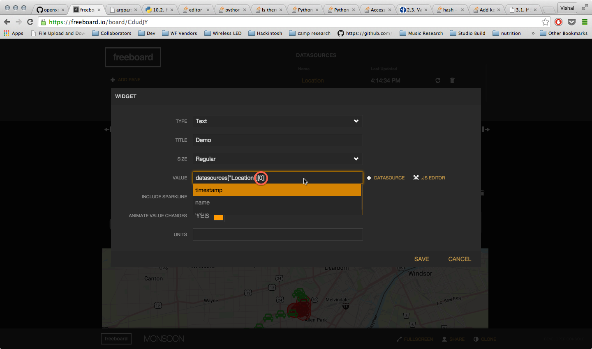

OpenXC Monsoon Freeboard Template
=================================

# Table of Contents
*   [How to Use](#how-to-use)
*   [Creating a Clone](#creating-a-clone)
*   [Source Files](#source-files)

How to Use
-----------

The OpenXC Monsoon Freeboard is an interactive web application that shows how OpenXC data coming from a group of vehicles can be plugged into Freeboard.io to provide real-time visual insight into the conditions of a monitored fleet.  

Begin by visiting [https://freeboard.io/board/5OQ4XW](https://freeboard.io/board/5OQ4XW)
The visualization will start automatically.

The dashboard shows a fleet of 20 vehicles traveling in variable conditions on a highway.

The car icons turn red if the windshield wipers are activated, or green if not.
  
As additional cars turn on their wipers, the widening areas of red can be interpreted as a heat map indicating areas where it is raining.  A user can click any car to see its individual speed, accelerometer pedal position, and brake status represented in the guage and indicator light widgets in the bottom row

Creating a Clone
--------------------------------

To use this template as a base for a new dashboard, first make sure you are signed in to your freeboard developer account then click Clone in the bottom right corner of the window.

This will create a new Freeboard instance of the template, accessible in your account.  You will now see the editing toolbars, and a new URL that links to your personal instance.

Clicking the Developer Tools link on the bottom right of the window will show the included sources that power the application.  

Source Files
------------

###monsoon_datasource.js

The Monsoon Datasource is a customized version of the [OpenXC Datasource](../openXCdatasource.js)  that takes one input json data file, subdivides it into 20 sub-datasources and iterates through to any connected widget at the user-defined refresh rate.  Widgets can attach to a sub-datasource by adding the sub-datasource index to the datasource name in the widget's Value field. (see screenshot below)

[Line 23](./monsoon_datasource.js#L23) sets the number of data points between each sub-division

###monsoon_widget.js

The Monsoon Widget is a custom version of the google maps widget that accepts input from up to 20 different datasources, and draws a car icon to represent each attached datasource.  If there is a windshield-wiper signal present in any of the datasources' payload, the car icon will turn red if the value of the signal is `true`.

###monsoonapp.js

Javascript responsible for implementing click action on monsoon widget, with setting Freeboard Datasource configuration.

###trace files

Processed json data files derived from the [Highway Commute and Local Stop](http://openxcplatform.com.s3.amazonaws.com/traces/localwithgps.json) OpenXC trace.  Used python scripts in [openxc json converter](../scripts/openxc_json_converter.py) to convert original trace file to valid JSON object, then [signal extractor](../scripts/signal_extractor.py) and [normalizer](../scripts/normalizer.py) to create individual json data files for optimal performance and codability.

###custom.css

Minor customizations to make background and table headers black