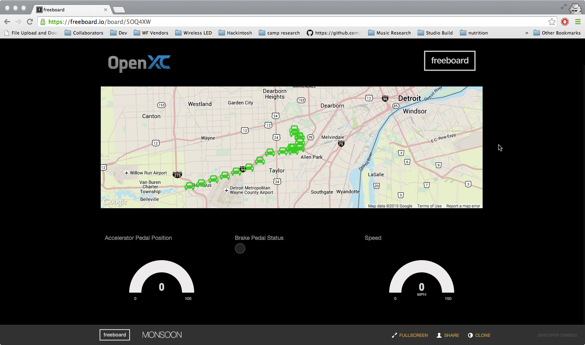
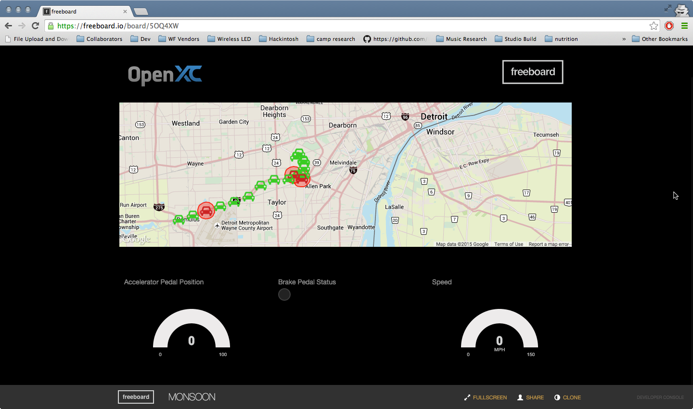
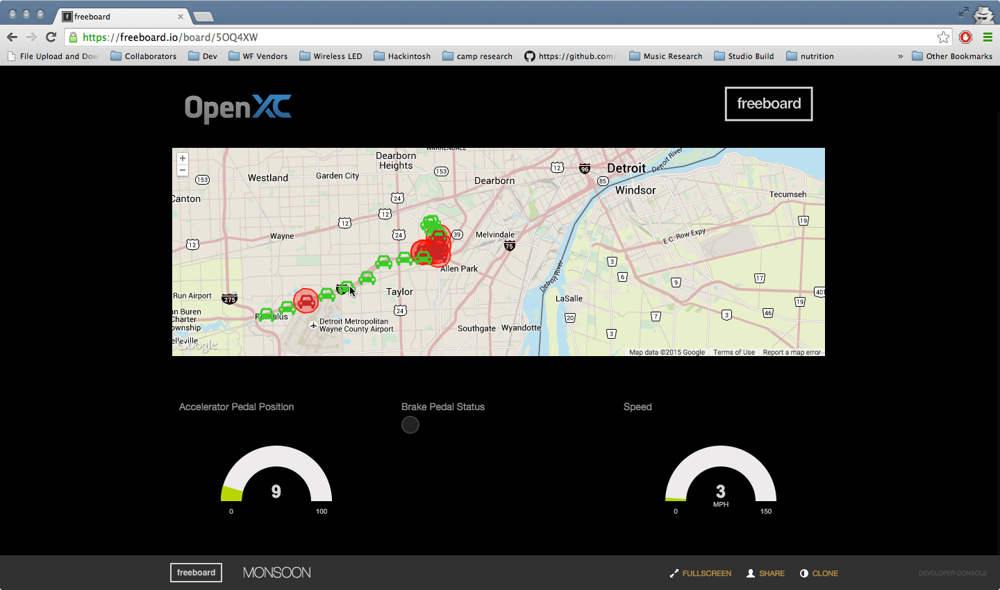
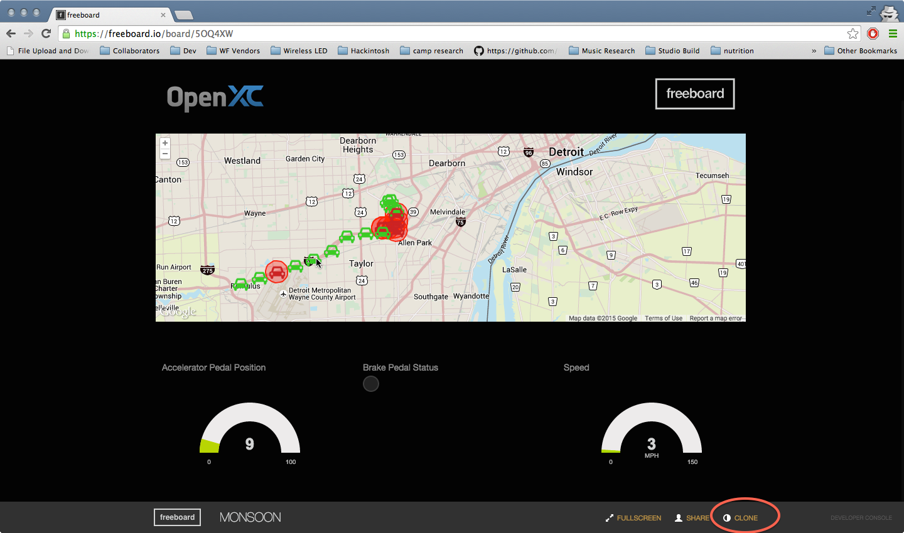
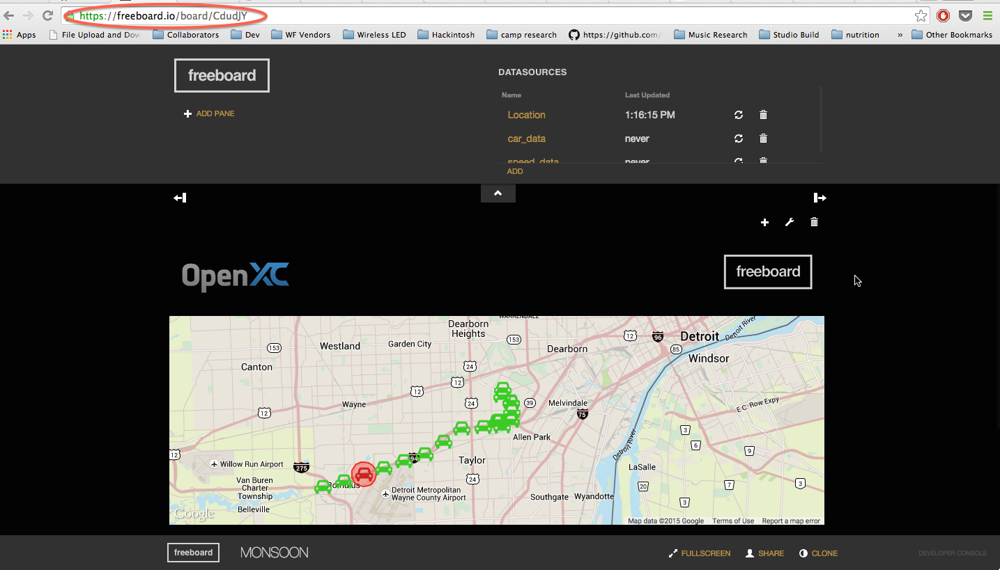
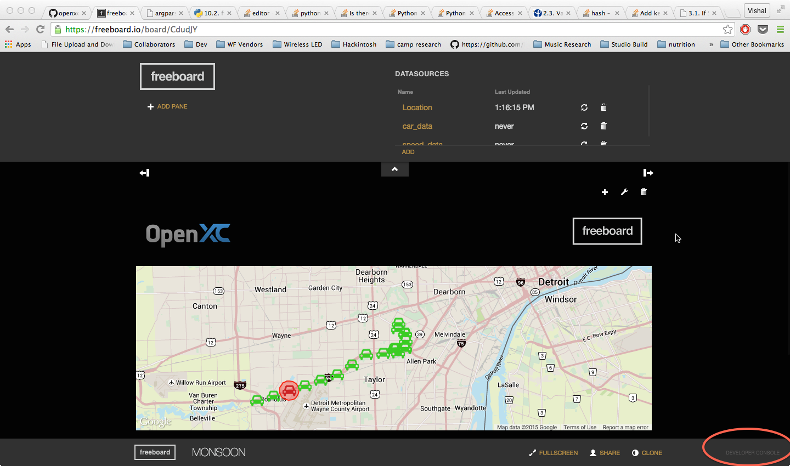
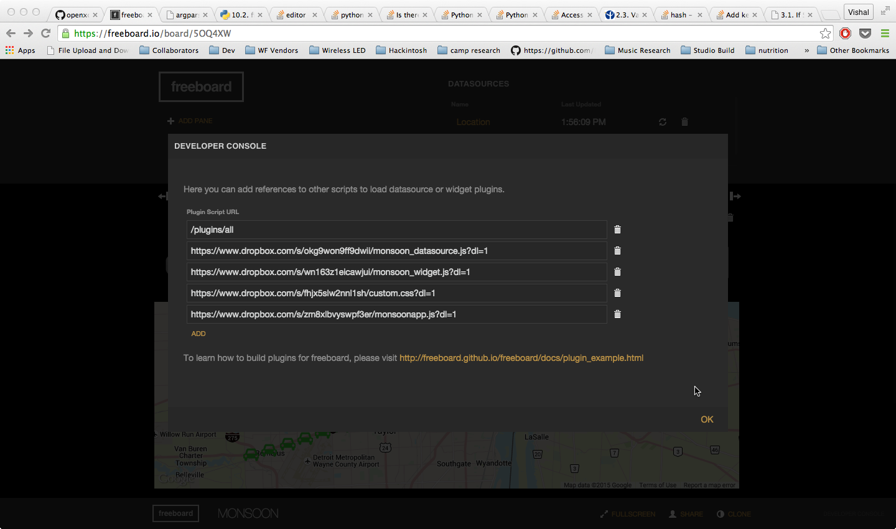

OpenXC Monsoon Freeboard Template
=================================

# Table of Contents
*   [How to Use](#how-to-use)
*   [Key Sources](#key-source-files)

How to Use
-----------

The OpenXC Monsoon Freeboard is an interactive web application that shows how OpenXC data coming from a group of vehicles can be plugged into Freeboard.io to provide real-time visual insight into the conditions of a monitored fleet.  

Begin by visiting [https://freeboard.io/board/5OQ4XW](https://freeboard.io/board/5OQ4XW)
The visualization will start automatically.

The dashboard shows a fleet of 20 vehicles traveling in variable conditions on a highway.

The car icons turn red if the windshield wipers are activated, or green if not.
  
As additional cars turn on their wipers, the widening areas of red can be interpreted as a heat map indicating areas where it is raining.  A user can click any car to see its individual speed, accelerometer pedal position, and brake status represented in the guage and indicator light widgets in the bottom row

Key Source Files
----------------

##Introduction
To use this template as a base for a new dashboard, first make sure you are signed in to your freeboard developer account then click Clone in the bottom right corner of the window.

This will create a new Freeboard instance of the template, accessible in your account.  You will now see the editing toolbars, and a new URL that links to your personal instance.

Clicking the Developer Tools link on the bottom right of the window will show the included sources that power the application.  

 