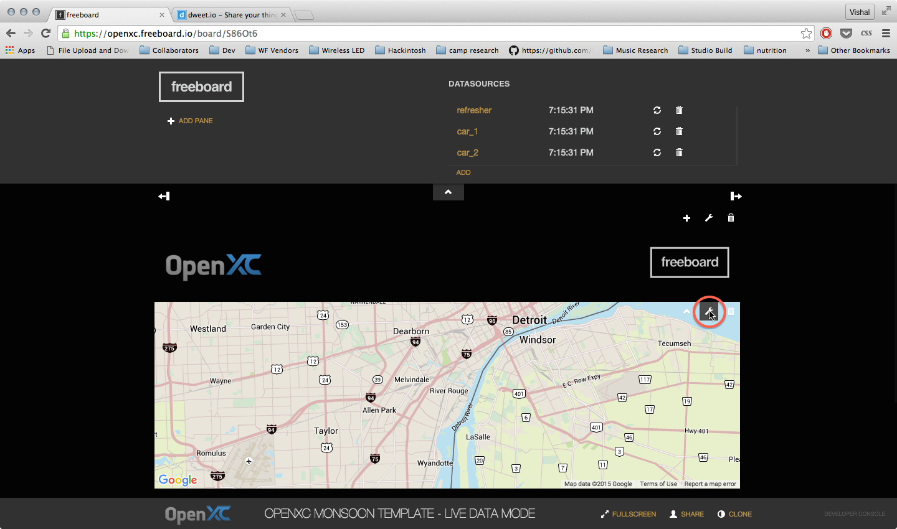
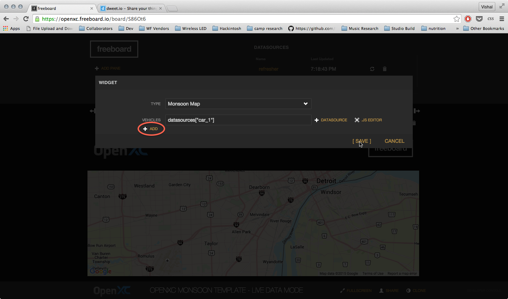
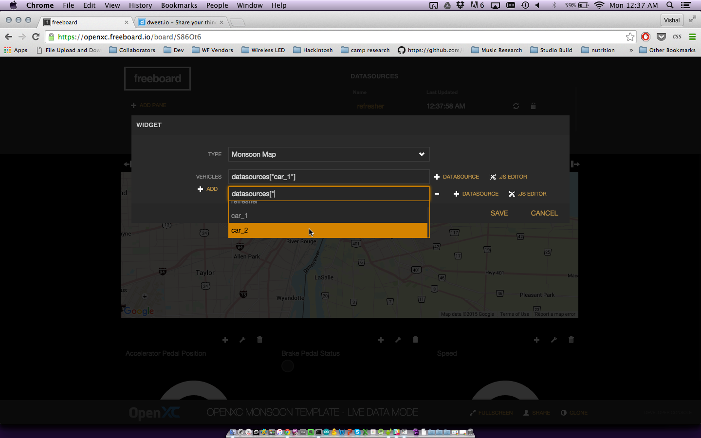

OpenXC Monsoon Freeboard Template
=================================

# Table of Contents
*   [Introduction](#introduction)
*   [How to Use](#how-to-use)
	* [Emulator Mode](#emulator-mode)
	* [Live Mode](#live-mode)
*   [Creating a Clone](#creating-a-clone)
*   [Source Files](#source-files)

Introduction
==========
The OpenXC Monsoon Freeboard is an interactive web application that shows how OpenXC data coming from a group of vehicles can be plugged into Freeboard.io to provide real-time visual insight into the conditions of a monitored fleet.  

There are two versions of the template:

SIMULATION MODE: 
https://openxc.freeboard.io/board/5OQ4XW 
This version shows a simulation of 20 fleet vehicles driving through inclement conditions on a freeway outside of Denver.  This offers the ability to interact with the application without the need of a fleet of OpenXC devices.  

LIVE MODE:
https://openxc.freeboard.io/board/pMhei6
The Live Data template responds to data coming from real OpenXC devices.  Add as many vehicles as you want via the customized OpenXC Monsoon Map Widget.

How To Use
==========
Emulator Mode
------------------
Begin by visiting https://openxc.freeboard.io/board/5OQ4XW
The visualization will start automatically.

The dashboard shows a fleet of 20 vehicles traveling in variable conditions on a highway.

The car icons turn red if the windshield wipers are activated, or green if not.
  
As additional cars turn on their wipers, the widening areas of red can be interpreted as a heat map indicating areas where it is raining.  A user can click any car to see its individual speed, accelerometer pedal position, and brake status represented in the guage and indicator light widgets in the bottom row

Live Mode
------------------
Begin by signing in to your openxc freeboard account, then navigate to the the host dashboard link at https://openxc.freeboard.io/board/pMhei6.  
Click Clone in the bottom right corner of the window.

This will create a new instance of the template, accessible in your account (at a new URL).

We now need to add in a Dweet.io Datasource for every openXC device you wish to connect to the map.  Click Add at the Datasources section.

Choose the Dweet.io Datasource

Name the datasource (we recommend something like 'car_1, car_2, car_3, etc') and enter in the thing-name.

Repeate the steps above for each device.

When all devices have been added as Datasource, we now need to attach the Datasources to the map.  Mouse over the top right corner of the map area, and click on the wrench icon that pops up (**note** pay special attention to not accidentally click the other widget/pan edit icons nearby).

Click the [+Datasources] button and choose one of the datasources created in the previous steps from the dropdown.  Do not choose any of the deeper levels.
 
Click the [+Add] button to add additional Datasources.
   

Click Save and refresh the page in your browser.  You will now see all of your devices populated in the map (**Note:** you may need to zoom out in the map to find your devices)
.
Click on any one of the vehicle icons to see its real-time accelerator pedal position, brake pedal status, and speed populated in the widgets below the map.

Source Files
------------

###openXCMonsoonDatasource.js

The Monsoon Datasource is a customized version of the [OpenXC Datasource](../openXCdatasource.js)  that takes one input json data file, subdivides it into 20 sub-datasources and iterates through to any connected widget at the user-defined refresh rate.  Widgets can attach to a sub-datasource by adding the sub-datasource index to the datasource name in the widget's Value field. (see screenshot below)

[Line 23](./monsoon_datasource.js#L23) sets the number of data points between each sub-division

###openXCMonsoonWidget.js

The Monsoon Widget is a custom version of the google maps widget that accepts input from up to 20 different datasources, and draws a car icon to represent each attached datasource.  If there is a windshield-wiper signal present in any of the datasources' payload, the car icon will turn red if the value of the signal is `true`.

###openXCMonsoonApp.js

Javascript responsible for implementing click action on monsoon widget, with setting Freeboard Datasource configuration.

###trace files

Processed json data files derived from the [Highway Commute and Local Stop](http://openxcplatform.com.s3.amazonaws.com/traces/localwithgps.json) OpenXC trace.  Used python scripts in [openxc json converter](../scripts/openxc_json_converter.py) to convert original trace file to valid JSON object, then [signal extractor](../scripts/signal_extractor.py) and [normalizer](../scripts/normalizer.py) to create individual json data files for optimal performance and codability.

###custom.css

Minor customizations to make background and table headers black
