OpenXC Social Freeboard Template
=================================

# Table of Contents
*   [Introduction](#introduction)
* [How to Use](#how-to-use)
	* [Emulator Mode](#emulator-mode)
	* [Live Mode](#live-mode)
*   [Source Files](#source-files)

Introduction
============
The OpenXC Social Template is a dashboard application that allows a user to monitor two other OpenXC clients and be alerted for any mishaps along their journey.

There are two versions of the template:

[EMULATOR MODE](#emulator-mode):
https://openxc.freeboard.io/board/SvtcP0

The Emulator Mode offers the ability to demo the functionality of the application without needing live OpenXC device data.  By using Dweet.io's Try it Now feature on any device with an accelerometer (ie: smartphones, laptops), you can tilt your device to emulate changes in a vehicle's sensors.

[LIVE DATA MODE](#live-data-mode):  
https://openxc.freeboard.io/board/cYoEd6

The Live Data Mode responds to data coming from real OpenXC devices.

Three alerts are included: 
* Distance - Triggered when either Sub User is outside a set proximity from the Master user (Default: 50 miles)
* Speed - Notifies Master user when either Sub User drives faster than the given speed threshold (Default: 90 MPH)
* Deceleration - Triggered when a Sub User decreases speed by the set amount between two subsequent updates (Default: 30 MPH)

**Note:  In either mode, the template will not function properly unless all three OpenXC devices are connected, or there is at least one historical dweet available for each device**

How to Use
==========

Emulator Mode
-------------

Begin by logging in to your OpenXC account, then navigate to https://openxc.freeboard.io/board/SvtcP0.  Click OK on the dialog, then click Clone to copy the template into your account. 

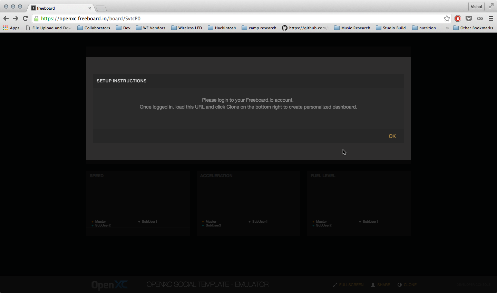

After loading the cloned dashboard, the configuration dialog will pop-up.

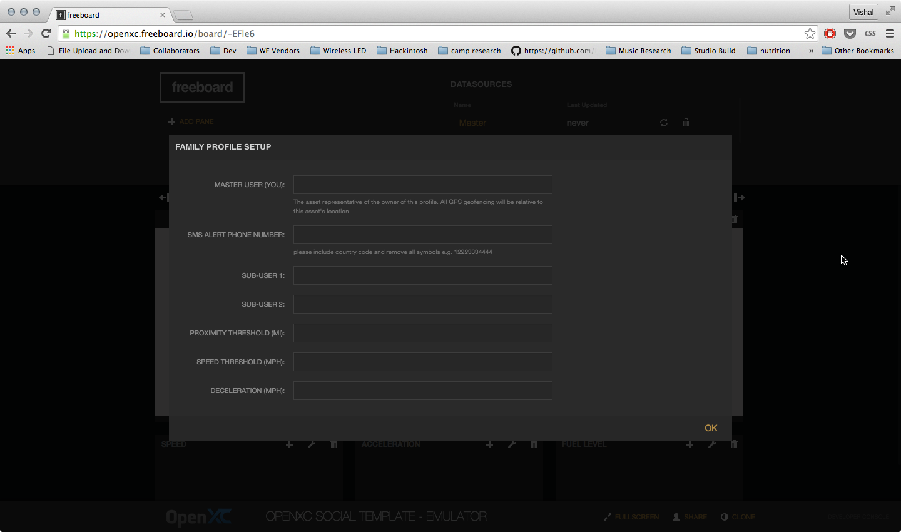

In emulator mode, the template is set up to respond to devices which are connected via the Try It Now feature on the dweet.io website.  We recommend the following set-up in order to experience all of the template's functionality from the comforts of your desk:

*    Master device - your laptop
*    SubUser1 - your smartphone
*    SubUser2 - random smartphone from dweet.io/see

Begin by navigating to http://dweet.io on your Master device.  Click the orange Try It Now feature (making sure to *enable location services* if it is not already).  

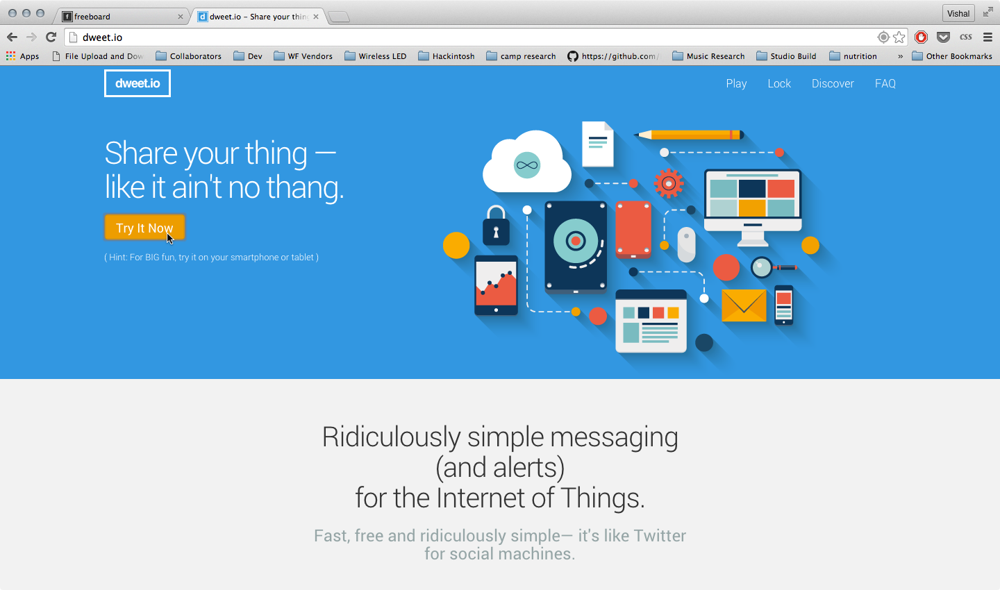

You will notice a white box open with your device's live data, and you will be given a bold, hyphenated *thing-name* which will be used as your master device's ID.

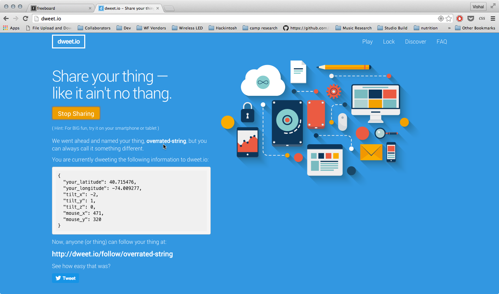

Repeat the above steps for SubUser1 on your smartphone, again making sure your location services are enabled, and noting the *thing-name* that is given.

For SubUser2, click on the Discover link in the top right corner of the dweet.io website. 

The page will load a list of devices currently running on the public version of Dweet.  We want to find another device that is using the Try It Now feature, which also has a location.  To do this, simply activate the Find function of your browser (usually Ctrl + f, or Command + f), and search for the term 'your_latitude'.  Note down the thing name beside that result (unless it is the same thing-name as your Master or SubUser1, in which case you should move to the next search result).

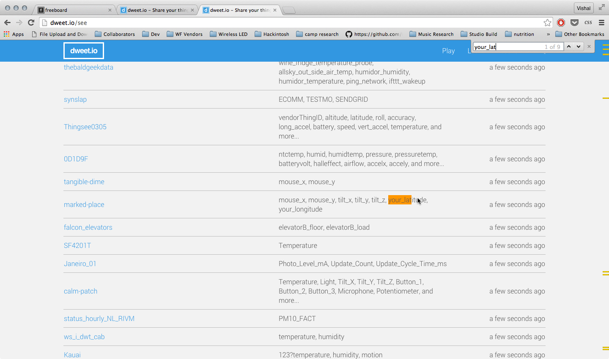
 
Return to the template configuration screen and enter in the thing-names you retrieved from the previous steps.  Enter in your mobile phone number into the SMS Alert Phone Number field (with the indicated format).  

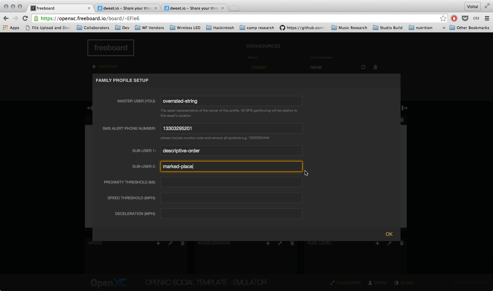

Complete the configuration by adding in values for the alert thresholds.  For testing we recommend the following settings:

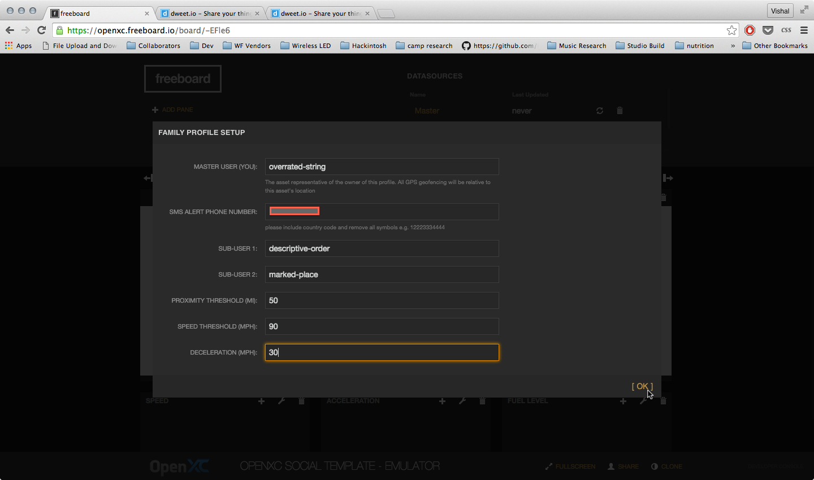

Click OK to save the configuration.  You will then be prompted to Refresh the page.

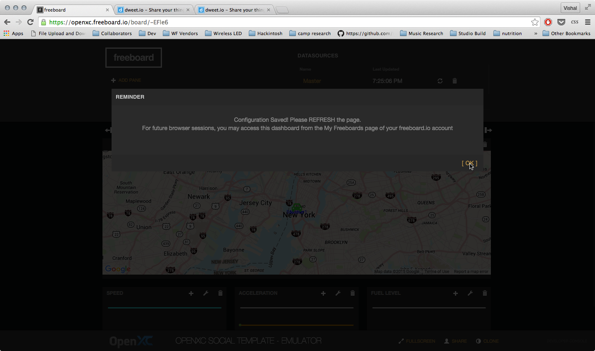

After refreshing, you should notice the map widget centered on the Master location, and the sparkline widgets (e.g. line graphs) populating.  Click the wrench icon to minimize the dashboard editing zone.

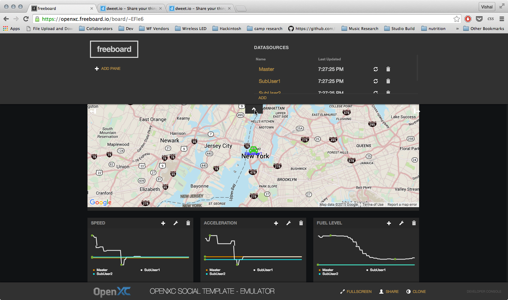

Most likely the dweet device we found on the Discover page for SubUser2 is somewhere far from your (e.g. the Master and SubUser1's) current location.  Click the maps [-] button to zoom out until you see SubUser2.  By now, you most likely will have received an SMS alert that "SubUser2 violated the distance threshold", and now you know why.

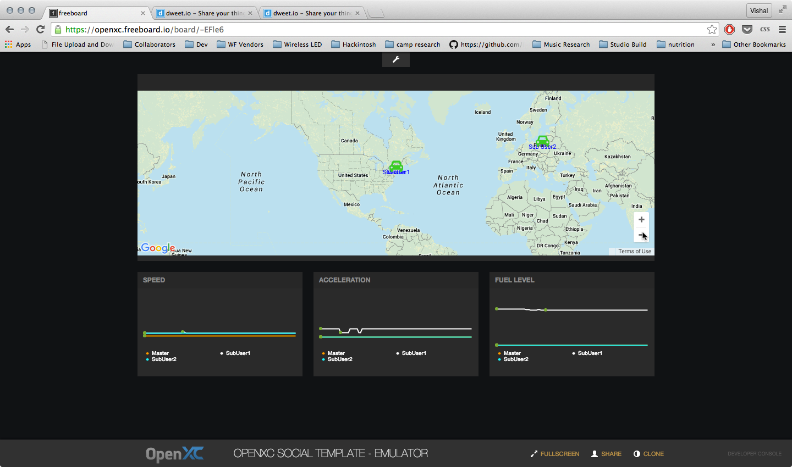

For the emulator version, the "Speed, Acceleration, and Fuel Level" widgets are fed by your test devices' "tilt_x, tilt_y and tilt_z" data, respectively.  In order to stimulate the speed and deceleration alerts, lay your smartphone (or SubUser1) flat, then swing up so that it is completely vertical, then swing back to a flat position.  If done properly, the SubUser1 line in the Speed widget will spike, and you should receive both a speed alert and a deceleration alert via SMS.

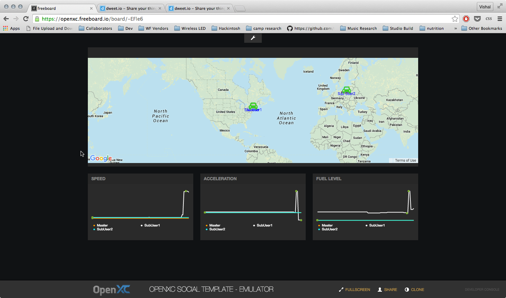
 

Live Mode
---------

Begin by connecting three OpenXC devices to Dweet.io using the special Dweet.io-integrated version of the OpenXC Enabler App (available in the [Releases](https://github.com/buglabs/openxc-buglabs/releases) tab).

Login to your OpenXC account, then navigate to https://openxc.freeboard.io/board/cYoEd6.  Click OK on the dialog, then click Clone to copy the template into your account. 

After loading the cloned dashboard, the configuration dialog will pop-up.

Enter in the thing-names corresponding to your various devices, as well as your mobile phone number into the SMS Alert Phone Number field (with the indicated format).  

Complete the configuration by adding in values for the alert thresholds.  For testing we recommend the following settings:

Click OK to save the configuration.  You will then be prompted to Refresh the page.

After refreshing, you should notice the map widget centered on the Master location, and the sparkline widgets populating (**Note: the sparklines will not populate unless all three OpenXC devices are connected, or there is at least one historical dweet available for each device)**.  Click the wrench icon to minimize the dashboard editing zone.

The dashboard is now fully set-up!  Be sure to leave the browser window open in order to receive SMS alerts for the various alert conditions.

Source Files
--------------
###[openXCSocialApp.js](./openXCSocialApp.js)
Contains all application logic to implement alert functionality, as well as the additional UI/UX elements for the template configuration.   

###[openXCSocialMapWidget.js](./openXCSocialMapWidget.js)
Customized version of the Freeboard.io Google Maps widget that displays three separate entities on one map.  Also includes optimizations that enable larger maps sizes than the stock maps widget.

###[phoneDatasource.js](./phoneDatasource.js)
 For the current release (version 1.0) of OpenXC Social Template, we use this datasource simply to store the master's phone number, to which alerts are sent.  For future versions, we will enable the commented lines to allow communication TO the dashboard from the master's phone via the Dweet.io-Twilio integration APIs.
