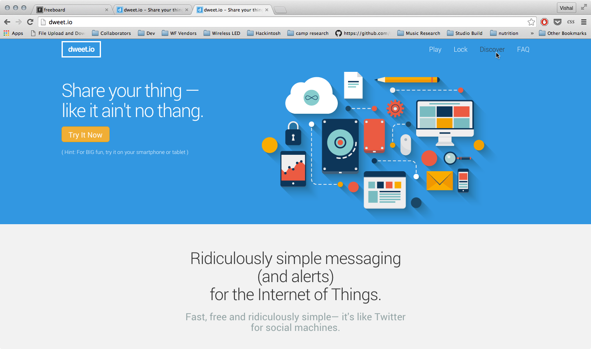
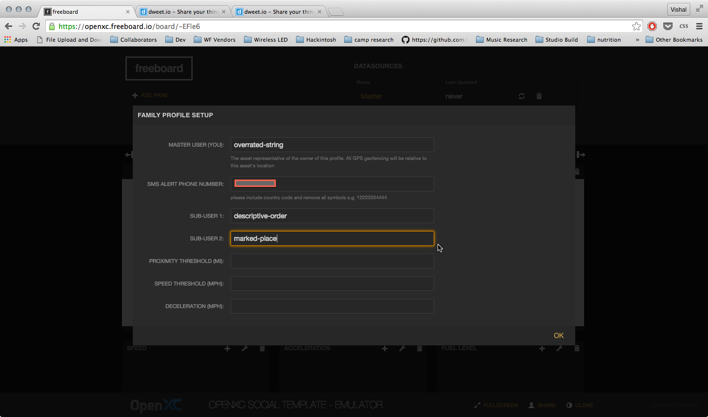

OpenXC Social Freeboard Template
=================================

# Table of Contents
*   [How to Use](#how-to-use)
*   [Source Files](#source-files)

How to Use
-----------

The OpenXC Social Template is a dashboard application that allows a user to monitor two
other OpenXC clients and be alerted for any mishaps along their journey.

There are two versions of the template:

LIVE DATA MODE:  
https://openxc.freeboard.io/board/cYoEd6

The Live Data template responds to data coming from real OpenXC devices

EMULATOR MODE:
https://openxc.freeboard.io/board/SvtcP0
The Emulator offers the ability to demo the functionality of the application without needing live OpenXC device data.  By using Dweet.io's Try it Now feature on any device with an accelerometer (ie: smartphones, laptops), you can tilt your device to simulate changes 

Begin by logging in to your OpenXC account, then navigate to the chosen version of the template.  Click OK on the dialog, then click Clone to copy the template into your account. 

After loading the cloned dashboard, the configuration dialog will pop-up.

In emulator mode, the template is set up to respond to devices which are connected via the Try It Now feature on the dweet.io website.  We recommend the following set-up in order to experience all of the template's functionality from the comforts of your desk:

Master device - your laptop
SubUser1 - your smartphone
SubUser2 - random smartphone from dweet.io/see

Begin by navigating to http://dweet.io on your Master device.  Click the orange Try It Now feature (making sure to *enable location services* if it is not already).  

You will notice a white box open with your device's live data, and you will be given a bold, hyphenated *thing-name* which will be used as your master device's ID.

Repeat the above steps for SubUser1 on your smartphone, again making sure your location services are enabled, and noting the *thing-name* that is given.

For SubUser2, click on the Discover link in the top right corner of the dweet.io website. 

The page will load a list of devices currently running on the public version of Dweet.  We want to find another device that is using the Try It Now feature, which also has a location.  To do this, simply activate the Find function of your browser (usually Ctrl + f, or Command + f), and search for the term 'your_latitude'.  Note down the thing name beside that result (unless it is the same thing-name as your Master or SubUser1, in which case you should move to the next search result).

)
 
Return to the template configuration screen and enter in the thing-names you retrieved from the previous steps.  Enter in your mobile phone number into the SMS Alert Phone Number field (with the indicated format).  

Complete the configuration by adding in values for the alert thresholds.  For testing we recommend the following settings:

Click OK to save the configuration.  You will then be prompted to Refresh the page.

After refreshing, you should notice the map widget centered on the Master location, and the sparkline widgets populating.  Click the wrench icon to minimize the dashboard editing zone.

Most likely the dweet device we found on the Discover page for SubUser2 is somewhere far from your (e.g. the Master and SubUser1's) current location.  Click the maps [-] button to zoom out until you see SubUser2.  By now, you most likely will have received an SMS alert that "SubUser2 violated the distance threshold", and now you know why.

For the emulator version, the "Speed, Acceleration, and Fuel Level" widgets are fed by your test devices' "tilt_x, tilt_y and tilt_z" data, respectively.  In order to stimulate the speed and deceleration alerts, lay your smartphone (or SubUser1) flat, then swing up so that it is completely vertical, then swing back to a flat position.  If done properly, the SubUser1 line in the Speed widget will spike, and you should receive both a speed alert and a deceleration alert via SMS.

 

