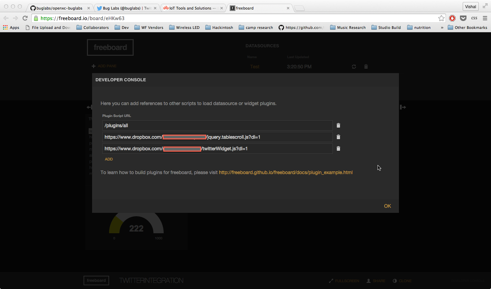
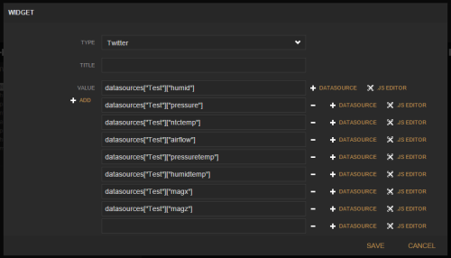
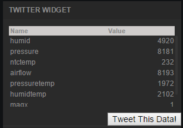

Twitter Widget
=================================

# Table of Contents
*   [Introduction](#introduction)
*   [How to Use](#how-to-use)

Introduction
------------
The Twitter widget creates a table view to see multiple stats in real-time along with a Tweet button.  Once the Tweet button is pressed, the current data is wrapped up and a Twitter pop-up allows you to confirm sending of the tweet.

An Error message will show if you have gone over the Twitter character limit. There is no datasource limit in the widget itself, so it is possible to run over the 140 character limit of Twitter.  

How to Use
-----------
Download the source files (jquery.tablescroll.js and twitterWidget.js) from github, and host on your favorite server or a file storage service (we prefer Dropbox).
Add the source files via the Developer Console.  (Note: if using dropbox, remember to change the end of the share link URL to '?dl=1' )

Refresh the page and you will now see the Twitter widget in the list of available widgets.  Adding data to the widget is the same as any other widget in freeboard. First, you select Twitter in the drop down menu of widget options, then you add data by clicking on the +DATASOURCE button. You can add as many data streams as you like by pressing the +ADD button as shown below:

You will now see the table updating with live data and the Tweet button.  Click the Tweet button at any point to create the tweet and confirm the send.

